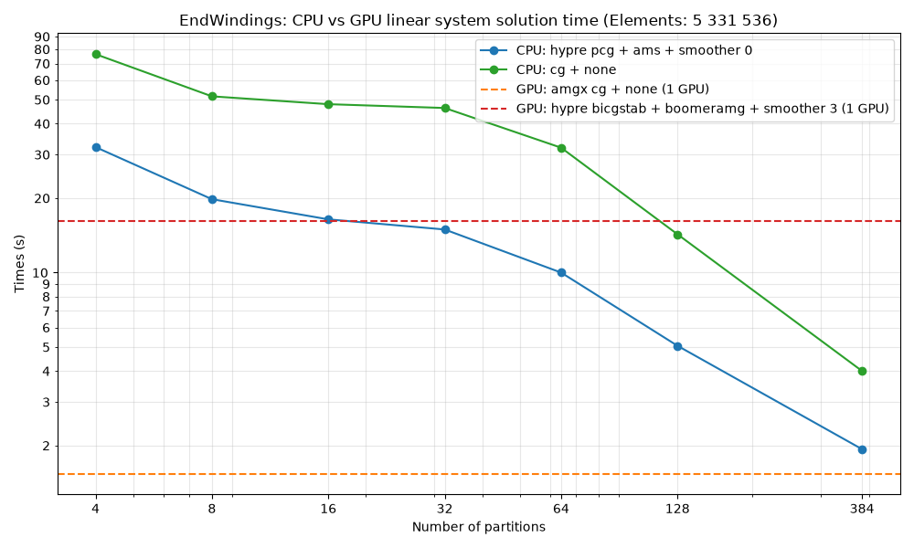

## GPU tests

In the EndWindings test case on Roihu we mainly focused on comparing the Elmer solvers running on CPU vs GPU. The measurments showed that AMGX solvers ran on the GPU perform very well and 1 GPU outperforms a full CPU node. With hypre [linsys/hypre_BiCGStab_BoomerAMG_gpu.sif](../../../linsys/hypre_BiCGStab_BoomerAMG_gpu.sif) ran on GPU, the results were not as convincing. Since the measurments, Hypre had a few changes on the Elmer side and runs faster now, but AMGX library still remains the faster option for NVIDIA gpus.

The EndWindings problem is a positive (semi)definite problem and CG solvers performed particulary well (although not mathematically correct, but they do converge to a solution). The recommended strategy for the linear solvers (that not only applies to this problem, but in general for problems using CG) is to use AMGX solvers running on the GPUs. If the problem is not (semi)definite, the BiCGStab option ran with AMGX is also a good option.

If one has a a large enough test case and cannot use NVIDIA GPUs, Hypre can also be well utilized on the GPU. The solvers setup (AMS and AMG) that support Hypre on GPUs can be found at [solver-lists/GPU-Solvers.txt](../../../solver-lists/GPU-Solvers.txt)

It is imporant to note how hypre is compiled (either --enable-unified-memory or --with-cuda). Both are available, but --with-cuda in theory should be faster after rewriting the Hypre interface in Elmer.

The measurments were done on 1 GPU, but both Hypre and AMGX support multi-GPU runs (multi-node GPU runs might be complicated and not available though).

## CPU tests

The tests that were done in [EndWindings-CPU](EndWindings-CPU) showed that using Preconditined CG from Hypre was the only usable solver for larger problems - the other solvers either timeouted or did not converge.